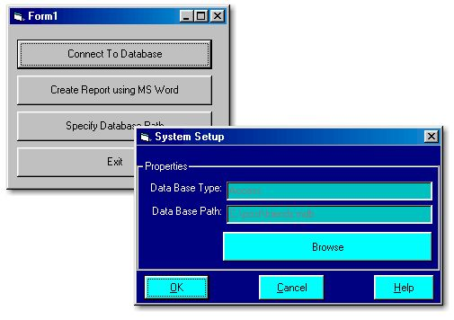



## A must have for all DB Programmers \(Using DAO\)

### Description

I wrote this code when i was developing a software for an Estate Agent.

The code copies the database path in the System Registry and everytime picks it from the registry. If connection fails another dialog box opens where you can specify where the Database is saved.

Secondly, you can take out the report of all the data in the table using MS Word. A small routine to accomplish the task.

This is basically a three in one program. Save DB Path in the registry, Create Report using MS Word and Specify the database path.

Just copy extract the .zip in C:\post directory.

Please rate it.
 
### More Info
 

             |
---                |---
**Submitted On**   |2002-05-27 16:22:34
**By**             |[Nitin Bagga](https://github.com/Planet-Source-Code/PSCIndex/blob/master/ByAuthor/nitin-bagga.md)
**Level**          |Beginner
**User Rating**    |4.7 (90 globes from 19 users)
**Compatibility**  |VB 3\.0, VB 4\.0 \(16\-bit\), VB 4\.0 \(32\-bit\), VB 5\.0, VB 6\.0, VBA MS Access
**Category**       |[Databases/ Data Access/ DAO/ ADO](https://github.com/Planet-Source-Code/PSCIndex/blob/master/ByCategory/databases-data-access-dao-ado__1-6.md)
**World**          |[Visual Basic](https://github.com/Planet-Source-Code/PSCIndex/blob/master/ByWorld/visual-basic.md)
**Archive File**   |[A\_must\_hav873295272002\.zip](https://github.com/Planet-Source-Code/nitin-bagga-a-must-have-for-all-db-programmers-using-dao__1-35138/archive/master.zip)

